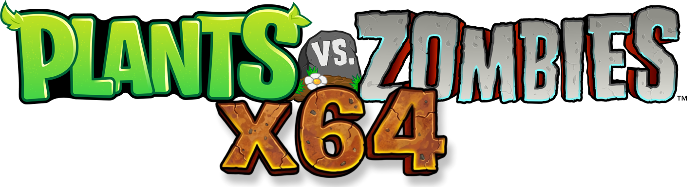

# PvZ-x64 — Plants vs. Zombies Reconstructed & Ported to x86_64



[-blue.svg)](#)
[](#)
[-red.svg)](#)
[](#)

> [!WARNING]
> **Project Status:** This project is an early development build. As a ported 64-bit reconstruction of the original 32-bit game engine, bugs, compatibility quirks, and performance glitches may occur.

Reconstructed and modernized source code of **Plants vs. Zombies (PC)**, updated to compile natively for 64-bit (x86_64) systems on both Windows and Linux.

This implementation builds upon the original (~2009) game logic utilizing a modernized, SDL2-based version of PopCap's proprietary **SexyAppFramework**.

---

## Features

* **64-bit (x86_64) Native Support** — re-engineered memory offsets and deserialization layouts for 64-bit.
* **Native Linux Target** — SDL2 and OpenGL, with Wayland, audio, and rendering fixes.
* **Windows Cross-Compilation** — MinGW-w64 from Linux, or native MSVC build from the `.sln`.
* **Configurable Frame Rate & VSync** — software frame limiter (default 120 FPS), toggleable VSync via `PVZ_VSYNC`.
* **BASS Audio** — `libbass.so` on Linux, `bass.dll` on Windows.
* **Quality-of-Life Features** — auto-sun collection toggle, 2× fast-forward button, keyboard hotkeys (F=fast-forward, 1-9=seed select, J=toggle auto-sun, Space= pause, F1=hotkey help, Ctrl+R=restart, F3=FPS overlay).
* **FPS Overlay** — press F3 to toggle an on-screen FPS counter.

---

## Build

### Native Linux

```bash
# Dependencies (Debian/Ubuntu)
sudo apt install build-essential cmake libsdl2-dev pkg-config

# Release (no cheats, DRM enabled)
bash build_linux.sh

# Debug (cheats enabled)
bash build_linux_debug.sh

# Manual
cmake -B build-linux -DCMAKE_BUILD_TYPE=Release
cmake --build build-linux -j$(nproc)
```

Output: `build-linux/PvZ-Linux`

### Windows Cross-Compilation (From Linux)

```bash
# Dependencies (Debian/Ubuntu)
sudo apt install gcc-mingw-w64-x86-64 g++-mingw-w64-x86-64 cmake make wine

# Build (pass "Debug" for debug build)
bash build.sh          # Release
bash build.sh Debug    # Debug

# Manual
cmake -B build -DCMAKE_TOOLCHAIN_FILE=../mingw-toolchain.cmake -DCMAKE_BUILD_TYPE=Release
cmake --build build -j$(nproc)
```

Output: `build/PvZ-x64.exe`

Build scripts auto-copy `libbass.so` / `bass.dll` + SDL2.dll + MinGW runtime DLLs + assets from `Debug/`.

---

## Run

Requires original game assets (`properties/`, `images/`, `sounds/`, etc.) next to the binary.

### Linux (Native)

```bash
env LD_LIBRARY_PATH="." ./PvZ-Linux
```

Environment variables:
| Variable | Default | Description |
|----------|---------|-------------|
| `PVZ_FPS` | `120` | Target frame rate |
| `PVZ_VSYNC` | `0` | Set to `1` to enable hardware VSync |

Example:
```bash
env LD_LIBRARY_PATH="." PVZ_FPS=144 PVZ_VSYNC=1 ./PvZ-Linux
```

### Windows / Wine

```bash
bash run.sh    # forces Mesa drivers for Nvidia compatibility
# or directly:
wine PvZ-x64.exe
```

---

## Repository Structure

```
.
├── main.cpp                  # Entry point
├── LawnApp.cpp / .h          # Top-level application class
├── Resources.cpp / .h        # Resource ID definitions (1345 lines)
├── ConstEnums.h              # Game enums (1322 lines)
├── GameConstants.h           # Shared game constants
├── Lawn/                     # Game logic
│   ├── Board.cpp             # Board updates, rendering, input
│   ├── Plant.cpp             # Plant behaviors, projectile spawning
│   ├── Zombie.cpp            # Zombie AI
│   └── ...                   # Challenge, ZenGarden, Widgets, System
├── SexyAppFramework/         # PopCap framework (SDL2/Direct3D, audio, UI)
├── Sexy.TodLib/              # Animation, particles, audio library
├── ImageLib/                 # zlib, libpng, libjpeg, JasPer JPEG2000
├── PakLib/                   # .pak resource pack reader
└── compat/                   # Cross-platform shims (Windows.h, min/max)
```

---

## Porting Notes

- **LP64 `ulong`** — `unsigned long` is 8 bytes on Linux, 4 on Windows. `ulong` is redefined as `unsigned int` in `compat/` to keep ARGB pixel arrays correct.
- **Color UB** — Signed left-shift of 32-bit color values (e.g. `mAlpha << 24`) triggers UB at `-O2`/`-O3`. All shifts cast to `uint32_t`.
- **SWTri struct padding** — `SWHelper::XYZStruct::mDiffuse` changed from `long` to `uint32_t` for consistent layout across LP64/LLP64.
- **32-bit serialized data** — Level/animation files use 32-bit pointer layouts. `Definition.cpp` parses and remaps them to 64-bit.
- **Frame rate decoupling** — Logic ticks at fixed 125 Hz, render runs at `PVZ_FPS` (default 120). VSync off on Linux.
- **Force-included compat header** — `compat/pvz_compat.h` is `-include`d via CMake on MinGW to provide mixed-type `min`/`max` overloads matching MSVC behaviour.

---

## Legal Disclaimer & Asset Notice

> [!WARNING]
> **This repository does NOT contain copyrighted game assets.**
>
> No graphics, textures, audio tracks, music files, levels, dialogue, or `.pak` asset archives from the original game are hosted in this repository.
>
> This project is strictly a non-commercial, educational reverse-engineered reconstruction of the C++ source code. Running the game requires:
> 1. A legally acquired copy of the original **Plants vs. Zombies (PC)** game.
> 2. Manually extracting the game assets (e.g. `images/`, `sounds/`, `properties/`) and placing them next to the compiled executable.
>
> *Plants vs. Zombies is a registered trademark of PopCap Games and Electronic Arts. This project is unaffiliated with, and unauthorized by, Electronic Arts or PopCap Games.*

---

## Credits

* **Original Game:** PopCap Games (Electronic Arts)
* **Reconstructed Source & Port:** The PvZ Reverse Engineering Community and contributors.
