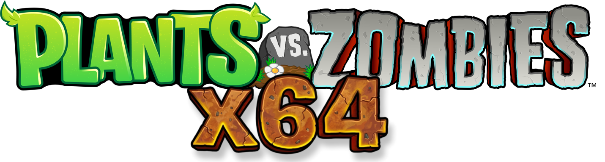

# PvZ-x64 — Plants vs. Zombies Reconstructed & Ported to x86_64



[-blue.svg)](#)
[](#)
[](#)
[-red.svg)](#)
[](#)

> [!WARNING]
> **Project Status:** This project is a modernized, reverse-engineered 64-bit source reconstruction of Plants vs. Zombies (PC). It is actively maintained and supports native 64-bit compilation on both Linux and Windows.

---

Reconstructed and modernized source code of **Plants vs. Zombies (PC)**, refactored to compile natively as a 64-bit (`x86_64`) application for Linux and Windows. 

This implementation builds upon PopCap's original C++ game engine and **SexyAppFramework**, upgraded to C++17 with full SDL2 integration for Linux, native Direct3D/SDL2 support for Windows, and comprehensive 64-bit pointer and structure compatibility fixes.

---

## Key Features

* **Native 64-bit (x86_64) Architecture** — Fully modernized memory layouts, structure alignment, LP64/LLP64 type compatibility shims, and 32-bit to 64-bit binary asset pointer remapping.
* **Native Linux & Windows Support** — Native Linux rendering via SDL2 + OpenGL, alongside Windows compilation via MinGW-w64 (cross-compile from Linux) or Visual Studio (`.sln`).
* **BASS Audio Subsystem** — Fully functional sound effects and music engine powered by `libbass.so` (Linux) and `bass.dll` (Windows).
* **Decoupled Tick & Render Engine** — Game logic ticks at a fixed 125 Hz rate, while rendering runs at a configurable frame rate (`PVZ_FPS`, default 120 FPS) with optional hardware VSync (`PVZ_VSYNC`).
* **Quality-of-Life (QoL) Controls** — Integrated fast-forward toggle (2× speed), auto-sun collection, hotkey shovel selection, keyboard seed picking, sound muting, and quick restart.
* **On-Screen Overlays & Dialogs** — Toggleable real-time FPS overlay (`F3`) and built-in hotkey reference modal (`F1`).
* **Developer Debug & Cheat System** — Optional Debug build configuration enabling developer cheat keys, level selector dialogs, and instant testing shortcuts.

---

## Controls & Hotkeys

| Hotkey | Action | Description |
| :--- | :--- | :--- |
| `Space` / `Enter` | **Pause / Resume** | Toggle game pause state |
| `F` | **Fast-Forward** | Cycle game speed (1× → 2× → 4×) |
| `J` | **Auto-Collect Sun** | Toggle automatic collection of dropped sun coins |
| `1` – `9` | **Select Seed Slot** | Quickly select seed packet in slots 1 through 9 |
| `Q` | **Toggle Shovel** | Pick up or deselect the shovel |
| `M` | **Toggle Mute** | Instantly mute or unmute all music and SFX |
| `Ctrl` + `R` | **Restart Level** | Prompt confirmation dialog to restart the current level |
| `Esc` | **In-Game Menu** | Open options menu or cancel current cursor selection |
| `F1` | **Hotkey Help** | Display the hotkey reference dialog on screen |
| `F3` | **FPS Counter** | Toggle the real-time FPS overlay |

---

## Prerequisites & Dependencies

### Linux (Debian / Ubuntu / Mint)

```bash
# Build tools, C++ compiler, CMake, and SDL2 development libraries
sudo apt install build-essential cmake libsdl2-dev pkg-config

# Optional: MinGW-w64 toolchain & Wine for Windows cross-compilation
sudo apt install gcc-mingw-w64-x86-64 g++-mingw-w64-x86-64 wine
```

### Arch Linux / Manjaro

```bash
sudo pacman -S base-devel cmake sdl2 pkgconf
# For Windows cross-compilation:
sudo pacman -S mingw-w64-gcc wine
```

### Fedora / RHEL

```bash
sudo dnf install gcc-c++ cmake SDL2-devel pkgconfig
# For Windows cross-compilation:
sudo dnf install mingw64-gcc mingw64-gcc-c++ wine
```

---

## Building from Source

### Native Linux Build

Use the provided `build_linux.sh` script to configure, build, and bundle runtime dependencies automatically:

```bash
# Release Build (Optimized, DRM enabled, cheats disabled)
bash build_linux.sh

# Debug Build (Debug symbols, cheat keys enabled)
bash build_linux.sh Debug

# Manual CMake instructions:
cmake -B build-linux -DCMAKE_BUILD_TYPE=Release
cmake --build build-linux -j$(nproc)
```

**Output Binary:** `build-linux/PvZ-Linux`

### Windows Cross-Compilation (From Linux via MinGW-w64)

```bash
# Release Build
bash build.sh

# Debug Build
bash build.sh Debug

# Manual CMake cross-compilation instructions:
cmake -B build -DCMAKE_TOOLCHAIN_FILE=../mingw-toolchain.cmake -DCMAKE_BUILD_TYPE=Release
cmake --build build -j$(nproc)
```

**Output Binary:** `build/PvZ-x64.exe`

### Windows Native Build (MSVC)

1. Open `Plantsvs.Zombies.sln` in **Visual Studio 2019 / 2022**.
2. Select target platform **x64** and configuration (**Release** or **Debug**).
3. Build the solution (`Ctrl+Shift+B`).

---

## Running the Game

Running the game requires original game asset files (graphics, audio, and properties) placed in the executable directory or root directory.

### Native Linux Execution

```bash
# Execute with local library search path for BASS audio
cd build-linux
env LD_LIBRARY_PATH="." ./PvZ-Linux
```

#### Environment Variables

| Variable | Default | Description |
| :--- | :--- | :--- |
| `PVZ_FPS` | `120` | Target rendering frame rate limit |
| `PVZ_VSYNC` | `0` | Set to `1` to enable hardware VSync |

*Example:*
```bash
env LD_LIBRARY_PATH="." PVZ_FPS=144 PVZ_VSYNC=1 ./PvZ-Linux
```

### Windows & Wine Execution

```bash
# Run Windows executable under Wine on Linux (auto-enforces Mesa driver compatibility)
bash run.sh

# Or directly run via Wine / native Windows:
wine build/PvZ-x64.exe
```

#### Command-Line Arguments

* `-tod`: Enables Tod cheat and debug keys in Debug builds.

---

## Repository Structure

```
.
├── main.cpp                    # Application entry point
├── LawnApp.cpp / .h            # Central LawnApp controller & state manager
├── Lawn/                       # Core game logic implementation
│   ├── Board.cpp / .h          # Lawn board logic, rendering, entity loops, input
│   ├── Plant.cpp / .h          # Plant behaviors, shooting AI, animations
│   ├── Zombie.cpp / .h         # Zombie AI, movement, eating logic
│   ├── Projectile.cpp / .h     # Peas, cabbages, melons, butter, fireballs
│   ├── Challenge.cpp / .h      # Mini-games, Survival modes, Vasebreaker, I, Zombie
│   ├── ZenGarden.cpp / .h      # Zen Garden watering, fertilizing, plant management
│   ├── Hotkey.cpp / .h         # QoL hotkey manager & input dispatch
│   ├── System/                 # Save/load, player profiles, music triggers, DRM
│   └── Widget/                 # Game dialogs, almanac, seed chooser, options, store
├── SexyAppFramework/           # PopCap engine framework (SDL2 wrapper, graphics, widgets)
├── Sexy.TodLib/                # Tod animation engine, particle system, foley, trailing effects
├── ImageLib/                   # Built-in image codecs (zlib, libpng, libjpeg, JasPer JPEG2000)
├── PakLib/                     # Game resource archive (.pak) reader
├── compat/                     # Cross-platform 64-bit shims & Windows header compatibility
├── PopcapDocs/                 # Original PopCap framework documentation & reference manuals
├── CMakeLists.txt              # Cross-platform CMake build configuration
├── build_linux.sh              # Linux automated build script
├── build.sh                    # MinGW Windows cross-compilation script
├── run.sh                      # Wine launcher helper script
└── mingw-toolchain.cmake       # CMake toolchain file for MinGW-w64
```

---

## Technical Porting & Architecture Notes

* **LP64 Type Compatibility (`ulong` redefined):** On 64-bit Linux (LP64 data model), standard `unsigned long` is 8 bytes wide, which breaks 32-bit ARGB pixel array buffers and binary file structures. `ulong` is redefined to `unsigned int` (4 bytes) in `compat/` to maintain cross-platform structural identity.
* **Color Left-Shift Undefined Behavior Fix:** Under GCC/Clang optimization flags (`-O2`/`-O3`), signed left-shifting 32-bit color values (such as `mAlpha << 24`) triggers undefined behavior. All color bitwise shifts have been audited and cast to `uint32_t`.
* **Software Triangle (`SWTri`) Packing:** `SWHelper::XYZStruct::mDiffuse` was updated from `long` to `uint32_t` to guarantee identical 64-bit struct padding across MSVC (LLP64) and GCC (LP64).
* **32-Bit Serialized Asset Remapping:** Original binary level data and `.reanim` animation files were compiled with 32-bit pointer layouts. `Definition.cpp` dynamically parses and translates these 32-bit binary offsets into 64-bit memory addresses upon loading.
* **Decoupled Architecture:** Logic ticks operate at a fixed 125 Hz frequency to ensure deterministic simulation accuracy regardless of display refresh rate or system performance.
* **Process Exit Cleanup:** Game state saving, user configuration writing, and resource cleanup occur sequentially upon shutdown. On Linux, dynamic library unloading (`dlclose` on `libbass.so`) and SDL context teardown occur after game data is safely saved to disk.

---

## Legal Disclaimer & Asset Notice

> [!WARNING]
> **This repository does NOT contain copyrighted game assets.**
>
> No graphics, textures, audio tracks, music files, levels, dialogue, or `.pak` asset archives from the original game are included in this repository.
>
> This project is strictly a non-commercial, educational reverse-engineered reconstruction of the game engine C++ source code. To play the game, you must:
> 1. Own a legally acquired copy of **Plants vs. Zombies (PC)**.
> 2. Extract or copy the game assets (e.g. `properties/`, `images/`, `sounds/`, `reanim/`, `particles/`, `data/`, `compiled/`, or `main.pak`) into the output build directory next to the compiled executable.
>
> *Plants vs. Zombies is a registered trademark of PopCap Games and Electronic Arts. This project is unaffiliated with, and unauthorized by, Electronic Arts or PopCap Games.*

---

## Credits

* **Original Game & Engine:** PopCap Games (Electronic Arts)
* **Reconstructed Source & 64-bit Port:** The PvZ Reverse Engineering Community and contributors.
